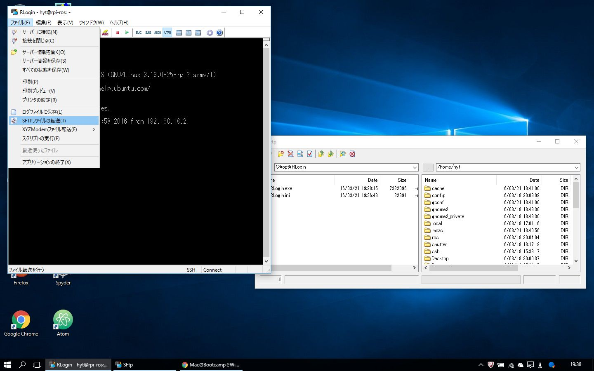

# 00_manual_setup.md
https://wiki.ubuntu.com/ARM/RaspberryPi
から取ってきたイメージを書き込んだ場合、microSDの容量をフルに使えません。  
まずは、手作業でmicroSDの全領域を使えるようにします。  
また、デフォルトで用意されているユーザーが、ユーザー名ubuntu,パスワードubuntuです。  
自分でユーザーを作って、以降は自分で作成したユーザーで操作を行います。  

上記ページのUsageからの作業内容です。  
日本語の解説は→http://qiita.com/sayonari/items/a9721afd92e2bfb34964  

# SD拡張操作内容
df -h  
 microSDのデバイス名を見るため．（/dev/mmcblk0p1 とか，/dev/sdb1 とかになっているはず．）  
sudo fdisk /dev/mmcblk0  
 fdiskの起動．  
p　[pを入力]  
 パーティション情報を確認．システムが「Linux」となっている部分を以下で削除する．  
d　[dを入力]  
2　[2を入力]  
 これで，パーティション2番を削除．  
n　[nを入力]  
 新規パーティション作成．  
p　[pを入力]  
2　[2を入力]  
ENTER　[標準値を使用]  
ENTER　[標準値を使用]  
w　[wを入力]  
 これまでのパーティション設定値を書き込み  
sudo reboot  
 OS再起動  
sudo resize2fs /dev/mmcblk0p2  
 パーティション容量リサイズ  
 これで，容量が増えます．df -hコマンドで，デバイスの容量を確認してSizeがmicroSDの容量と一致していたら成功です．  

# ユーザー作成
## userを任意の名前に書き換えましょう
sudo adduser user  
sudo gpasswd -a user sudo  

## install ssh to control by remote
sudo apt-get update  
sudo apt-get install openssh-server  

# sshクライアント(RLogin)を使ってuserでログインしてSFTP転送でシェルを転送
  
chmod +x *.shとする
