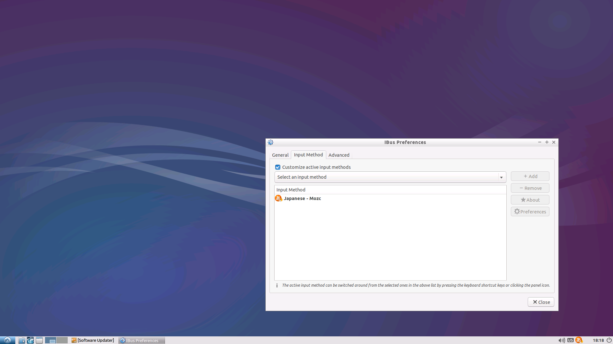

# localization
デスクトップ環境で日本語をベースにする設定をします。  

## キーボード設定
右下のキーボードのマークから設定を選択  
言語でJapanseを選択してMozcを選び、下記画像のような状態にする  
  

## UIの日本語化
スタートメニュー→Preferences→Language Supportを選択  
  
画面の指示に従いインストール実施  
  
Languageの項目で日本語を一番上に持ってくる  
Apply System Wideをクリックして再起動で日本語化完了  

再起動後に下記のようにフォルダ名を日本語に変えるか聞かれるが、英語のままの方がターミナルでの作業が楽なので、古い名前のままにするのをお薦めします。  
  
