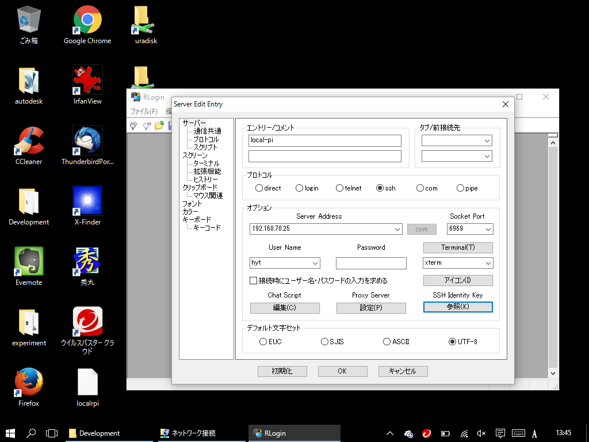
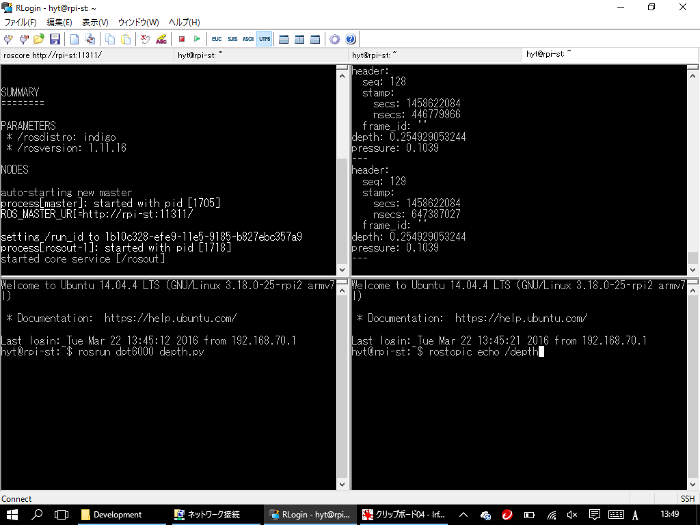
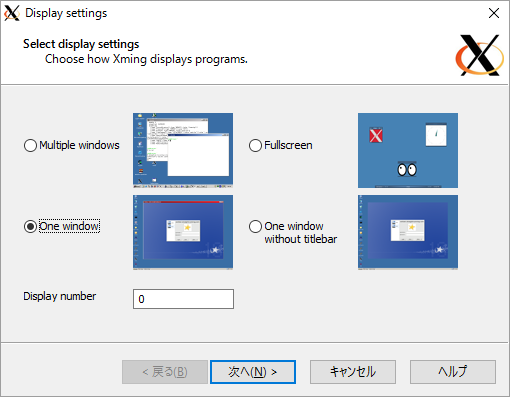
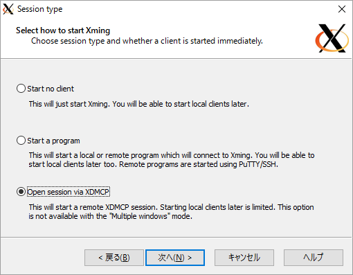
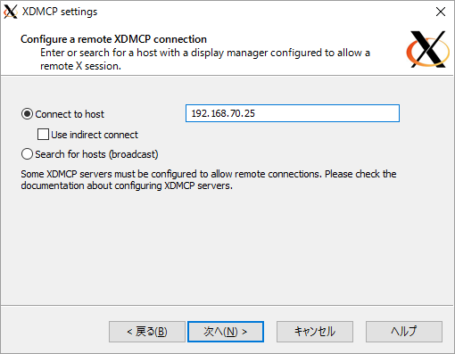
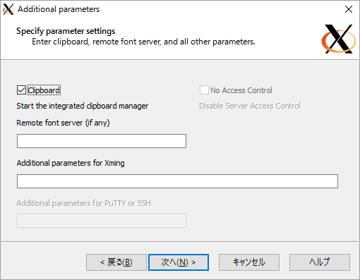
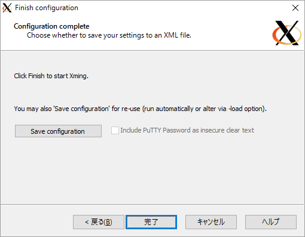
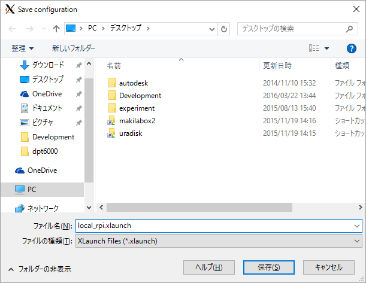
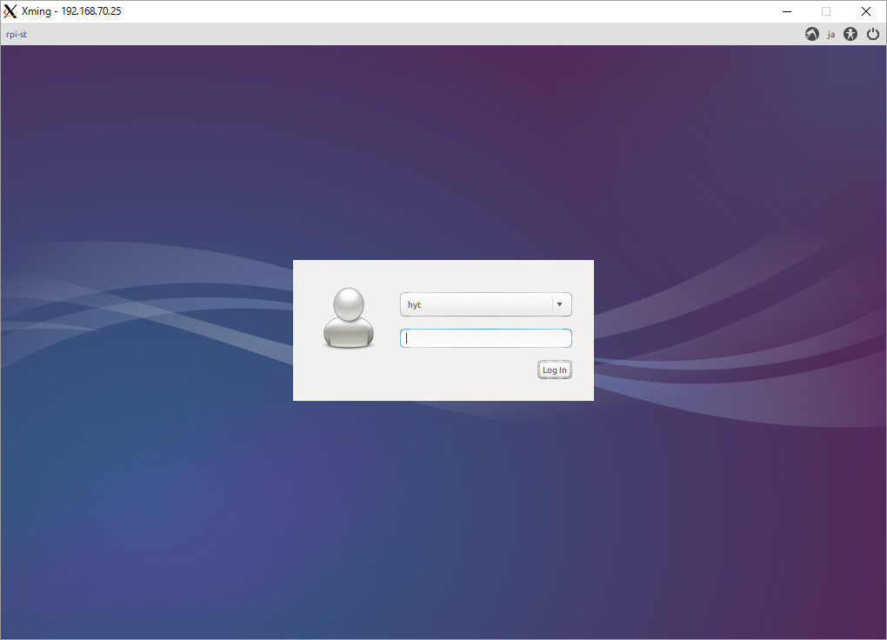

# remote control
構築したUbuntuの環境をネットワーク経由でリモートコントロールする方法の解説です。  
1. ssh(Secure Shell)を使ったCUIでの操作  
2. XDMCP(X Display Manager Control Protocol)を使ったGUIでの操作  

の二通りに方法について解説します。

# 想定環境
手元のPCとして、Windows 10がインストールされたPCを想定しています。  
本来、手元のPCのOSはなんでも構いませんが、一番ユーザーの多いであろうWindowsを前提に解説します。  

## ssh前提条件
下記の条件をまず最初に確認すること  
1. [RLogin](http://nanno.dip.jp/softlib/man/rlogin/)などのsshクライアントをインストールしておく  
2. ssh setupにて指定したポート番号でアクセスすること  
3. 上記2のポートがファイアフォール（gufwを想定）でアクセス拒否されていないこと  

## ssh接続  
sshのクライアントを起動して、下記を設定してOKをすると繋がる  
1. エントリー名（自分がわかりやすい名前）  
2. サーバーのアドレス  
3. ポート番号  
4. ユーザー名  
5. sshキーファイル(パスワードアクセスはこのリポジトリのセットアップシェルを使った場合は禁止)  
7. 文字コードとしてUTF-8  
  

## ssh操作例  
sshクライアントとして[putty](http://yebisuya.dip.jp/Software/PuTTY/)が有名であるが、RLoginは下記の図のようにウインドウを分割して利用できるため、ROSのようにコマンドをたくさん打つ場合はこちらのほうが便利なのでRLoginを推奨しておきます。  
  

## XDMCP前提条件
下記の条件をまず最初に確認すること  
1. [Xming](https://osdn.jp/projects/sfnet_xming/)というWindows用のX Windowのサーバーアプリケーションをインストールしておく  
2. UDPポート177、及び、TCPポート7100がファイアフォールでアクセス拒否されていないこと  
3. 手元のPC側のTCPポート6000がファイアフォールでアクセス拒否されていないこと(手元のPCがサーバーになっている)  

## XDMCP接続
X Launchを起動します。  
下記の画面が出てくるので、One windowを選択して次へ  
  

Open session via XDMCPを選択して次へ  
  

アクセスしたいコンピュータのアドレスを入力して次へ  
  

デフォルトのまま次へ  
  

Save configurationを押すと、次回以降この作業が省略出来ます。  
保存しておきましょう。  
  

わかりやすい名前をつけて保存する  
  

## XDMCPログイン
きちんと設定できていれば、GUIのログイン画面が出てきます。  
ここまでたどり着けばあとは、モニターを繋いで操作してるときと同じように操作できます。  
  
